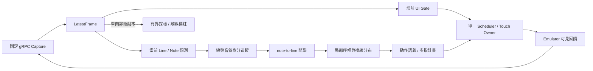

# 主程式架構與跨曲學習：證據、候選比較及分階段實驗

> 2026-09-29 最新執行範圍見[非學習式冷開發計畫](NON_LEARNING_COLD_DEVELOPMENT_PLAN_20260929.md)：新七輪已完成，先分析Dlyrotz／Hold／延遲，依判定線與Note形式做通用幾何及動作開發；本輪不啟動emulator、不訓練。以下歷史研究／M1結果依各段日期解讀，不代表新能力已實戰驗收。

> 同日續作：observer38／planner21僅部分冷驗收，使用者要求原task以持續goal完成計畫§8–9。將本研究§3.2的標記契約與§4.2的oracle消融用於非學習式工程校準：先復用C++資料工具，必要時用OpenCV產生proposed，不以自身候選當gold；真值合成／fake-clock補長Hold與組合缺口。人工双標與真遊戲效果分列，不阻塞可完成的冷開發，也不假稱已完成；M3／M4本輪不啟用。

> 2026-09-28 使用者已選定本文件為後續主線。研究提案與舊實驗紀錄的資料保留界線見[清理紀錄](CLEANUP_AUDIT_20260928.md)；本輪的離線進展另記於 M0 報告。

日期：2026-09-28。狀態：**使用者已指定為後續開發方向；新架構／模型仍未實作、未訓練、未取得新的遊戲能力驗收**。清理後已新增 [M0 線身分離線研究](LINE_IDENTITY_M0_20260928.md)，證明一個合成失效機制；不代表實戰根因已完全隔離。

原研究輪次只讀取既有程式／證據、檢索一手來源並新增本文件；沒有修改策略、啟動 emulator、採集新實戰、下載模型、訓練、merge 或 push。本文的數值門檻是待凍結的實驗提案，不會覆寫既有設定或重新授權暫停中的 AP goal。

**建議優先驗證的架構是「當前畫面實例觀測 → 判定線身分與音符身分 → note→line 關聯 → 局部座標撞線時間分布 → 可撤銷的多指動作計畫」**。先用已知線 ID 異常檢驗關聯生命週期，並以幾何策略處理多線、旋轉、突現與往返運動；只有證據確認仍有觀測／關聯缺口，才比較學習式方法。2026-09-28 使用者補充的[判定線形式](判定線形式.md)與遊玩經驗已納入 §2.7：形式複雜不等於需要學習，M3／M4 是有條件的分支。目前資料不足以支持直接訓練端到端動作策略。這是工程推論，並非已證明的最佳模型。

## 1. 現況、證據與未知

### 1.1 工作樹與授權界線

開始時 checkout 是 `codex/main-legacy-pixel-clips`，HEAD 為 `baf3d4fcbaac56ab085e19b9fba8a5ef6615d3bc`。本機 `main` ref 仍是 `01c3bcf61b127e0cb6b01f19fbd5181747456aa2`；因此「最新 main 策略」指 observer36／planner18，不等於目前 checkout 名為 main。實戰 binary 的 source 是 `cd0ec437f495ee73e92a1adaccd097a86eeb91ac`，後續 `baf3d4f` 為結果文件提交。

開始時只有他項工作的未追蹤檔 [LEGACY_CROSS_VERSION_ANALYSIS_20260928.md](LEGACY_CROSS_VERSION_ANALYSIS_20260928.md)。本輪閱讀並保留它，未修改、暫存或提交。其讀取時 SHA-256 是 `bc3785c0c0bbb54d2ee914e3ed00358a0206178ee5b5a7782192865bdffab418`。

已讀 [AGENTS](../AGENTS.md)、[README](../README.md)、[架構](ARCHITECTURE.md)、[路線圖](ROADMAP.md)、C++ 遷移計畫（CPP_MIGRATION_PLAN.md 已清理，歷史見 Git baf3d4f）、遷移盤點（CPP_MIGRATION_AUDIT.md 已清理，歷史見 Git baf3d4f） 及本節引用的當前證據；也讀取「盤點主程式實作進度」chat 的最新結論。舊文中的「持續自主開發」「HD AP 後才能 IN」「assist 尚禁用」「process runtime」是不同日期的歷史敘述，不能覆蓋 9/28 已完成有限跨曲比較、已另有兩輪 IN、目前僅授權研究的狀態。

正式邊界保持：自有正式邏輯 C++20、單程序多執行緒；gRPC payload fast／RGB888 top-down／256 KiB；latest-frame；host monotonic/QPC；能力指紋匹配的最多五指觸控。執行時不讀譜、內部狀態、記憶體、音訊節拍、歌曲身分、歌曲進度或歷史按鍵。允許的時間是近期像素運動的實際 `dt` 和排程期限。資料採樣可以使用診斷時鐘分配額度，但不得把它交給動作策略。

### 1.2 已核對的結算與診斷

| 證據 | 確定能說的事 | 不能推出的事 |
|---|---|---|
| [HD9 結果](HD9_LEGACY_HD_RESULTS_20260928.md)、[新版結果](MAIN_LEGACY_HD_COMPARISON_20260928.md) | 相同 19 首 HD，各 8,655 判定；Credits 舊版取最後完整重跑 B14；舊 Glaciaxion 不納入 | 不能把 20 張舊結算當 20 首獨立歌曲；不能選兩次 Credits 的最佳值作隱藏比較 |
| [舊 JSON](HD9_LEGACY_HD_RESULTS_EVIDENCE_20260928.json)、[新 JSON](MAIN_LEGACY_HD_RESULTS_EVIDENCE_20260928.json) | 本輪重新加總 P/G/B/M，見下表；新版 21 份 summary 與 21 張 result 的 hash 再核對，42/42 相符 | 本輪未重做所有原始 events／558 RGB 的逐檔 hash；那些全面核對是原報告的歷史紀錄 |
| [跨版分析](LEGACY_CROSS_VERSION_ANALYSIS_20260928.md) | 15 首新分數較高，14 首 Miss 減少；混乱、FULL AUTO SHOOTER、Pixel Rebelz 明顯退步 | 每版本多為一次且策略、採樣、時段一起變動；不是單項改動的因果 A/B |
| Pixel Rebelz round15／frame 238007–238009 | 相同記錄線幾何、ID 7603→7604→7605、association_valid=false；四個 Hold 候選 line_id=0 | 不是四個實際音符都 Miss 的逐音符真值；相同幾何也不能證明整張圖相同 |
| Dlyrotz IN13、光 IN12 | 各一輪，P/G/B/M 為 395/5/6/178、443/7/0/67 | 無舊版同譜面配對，不能當 HD→IN 的版本退步或 IN 泛化驗收 |
| [合併紀錄](MAIN_MERGE_20260928.md) | 保留 observer36／planner18；生命周期接入有獨立舊 library golden 與歷史三配置 206/206 | 合成 golden 不能證明完整遊戲、多線、旋轉或 AP；本輪未重跑測試 |

| 19 首 HD 統計 | observer33／planner13 | observer36／planner18 |
|---|---:|---:|
| Perfect | 7,698 | 7,795 |
| Good | 134 | 39 |
| Bad | 8 | 3 |
| Miss | 815 | 818 |
| 非 Perfect | 957 | 860 |
| Miss／判定 | 9.4165% | 9.4512% |
| 每曲分數平均 | 828,394.7 | 840,325.4 |

新版 818/860＝95.12% 的非 Perfect 是 Miss。混乱 Miss 47→101、FULL AUTO SHOOTER 61→93、Pixel Rebelz 74→92；三曲增加 104 個 Miss。這說明只優化已形成計畫的下壓時間不足以代表解決主要缺口，但不能排除時序錯誤造成 Miss。

時序反例亦須保留：在 Windows x64 Release、同 1280×720 gRPC fast／256 KiB／五指 lead35ms 的歷史比較中，混乱的 owner 消費 decision 間隔 n=6078→7593，p50/p95/p99/max=20.39/42.30/53.47/135.99→16.65/31.90/43.54/100.66ms；FULL AUTO SHOOTER n=6202→7505，19.63/41.37/54.68/979.42→16.58/31.88/43.45/963.76ms。兩曲間隔分布改善仍退步，故「全部是新一輪卡頓」不成立；接近一秒的尾端空窗仍未歸因。這些是 owner 實際消費的 decision 間隔，不是 capture callback、來源年齡或觸控生效延遲。來源：[跨版分析](LEGACY_CROSS_VERSION_ANALYSIS_20260928.md)。

### 1.3 現有資料真正支持的任務

本輪由 `measurements/game-assist/manual-session-108176133899800/pixel-clips/index.jsonl` 按 `(round_id, clip_id)` 重算：558 frames＝186 組三幀片段；首尾跨度 min/median/max＝7.015/34.18765/66.1642ms，各組跨度總和 6.4386211 秒，**不是連續六秒影片，也不是 558 份獨立場景**。前20輪只有18首HD＋2首IN，第21輪 ENERGY SYNERGY MATRIX 沒片段。140張 `detected_targets=0` 只代表舊候選器零輸出。

| 資料 | 現在可以做 | 尚不能做 |
|---|---|---|
| 558 張完整 RGB／186 triples，約1.437 GiB原始像素 | 制定標註規範；分群後標當前線／音符／部位；找反例；三幀局部一致性；核對零候選是否漏辨 | 沒人工實例、線關聯或遮擋真值；不可直接訓練並宣稱足夠；不能驗證長 Hold、完整旋轉、長遮擋重接 |
| 兩版 events、結算、manifest | 追溯門控與觸控收據；建立描述性逐曲結果；辨認具體待查事件 | 第一輪無相應像素片段；不能重跑其完整 pixels pipeline；無法由 Miss 總數反推出漏了哪些音符 |
| [早期 ROI 資料](VISION_DATASET_20260927.md) | 408 ROI／54 clips／3 run的具名子集可研究部位，已有 native mask／QA／export工具 | 都是同曲開發資料，人工覆核0；後續資料根達20run不表示全部高品質或相互獨立；不與558張相加當跨曲訓練量 |
| [T0/T1/T2 bank](TRACKING_COMPARISON_20260927.md) | 比較相同候選的分派、拒絕、成本；短合成144frames有局部真值 | 真實bank有 `baseline_guided` 偏差，IDSW等為unknown；10,000次重播不是10,000個實戰樣本 |

主要未知：真正未檢出音符比例、誤線與無線的各自比例、線 ID churn 的起因、接觸在遊戲內的實效、各類音符可見判定窗、來源絕對年齡、長 Hold 尾端可觀測性、模型在本機與 emulator 競爭GPU時的尾端延遲。不可把模型信心或擬合殘差直接叫已校準機率。

### 1.4 Pixel Rebelz 的最小根因研究

本輪核對摘錄 SHA-256：`61e83193a1fb55d7c63458353a2c6a06ee9b48e2a84e870d2eac78931d187d0e`，路徑 `measurements/cross-version-analysis-20260928/pixel-rebelz-line-identity-case.jsonl`。三幀中心 `(640,570.77976698)`、方向 `(0.96586834,0.25903350)`、長1325.23238、confidence=.85；四個Hold候選18171/18172/18166/18167持續被 `line_unobservable` 擋住。

程式入口是 [GameLineTracker::update](../src/game_motion.cpp) 約104行：競爭配對設 `association_valid=false`，未分派觀測仍新增 track；舊 track 在90ms內保留。[音符關聯](../src/game_tracking.cpp) 約98行跳過 association 無效的線，並偏向既有 line_id，再以 confidence／length 選線。**推論**：一旦有近重複 track，拒配→再出生→更多競爭可能形成短期自我維持的歧義；尚未隔離證明，不能現在就寫成根因。

最小實驗應有兩級：①直接餵入相同線觀測與已知合成前置 track 狀態，重現競爭／出生／到期；②從足夠事前畫面暖機後重播真實 pixels，接 FakeTouch 檢查全鏈。現有三幀若沒有之前90ms的狀態，冷啟動不重現不能推翻問題。記錄每個候選對的成本、最佳／次佳差距、track出生原因及生命期；比較「目前 greedy」「全域 assignment＋不在歧義時生重複track」「短窗多假設」。真實修正須保留兩條相近獨立線的負例，不能直接合併所有近線。

## 2. 候選架構比較與建議模組

### 2.1 比較矩陣

下列成本為相對工程評估，非本機測速。所有候選須共用輸入解析度／時間戳、固定資料split、相同後端及deadline；先比較離線，再取得live資格。

| 路徑 | 觀測／時間各負責什麼 | 資料、標註與部署 | 優點 | 主要失效與淘汰條件 |
|---|---|---|---|---|
| A 可解釋幾何基線 | 當前ridge、連通區、輪廓；線方程＋局部短期擬合；全域關聯 | 不須訓練，仍須實例真值評估；C++直接落地；CPU成本可逐步量測 | 最容易定位哪個pixel條件阻擋；保留現有成果；便宜的根因對照 | 美術／灰Hold／特效可能漏掉；若跨曲漏辨在標註集顯著限制上限，停止堆歌別規則，保留作參考／驗證器 |
| B 模組化學習觀測＋幾何關聯 | 單幀學線、note部位、可見性；tracker估身分與運動；relation決定note→line | 千級核對影格起試點、後續數千至萬級；C++ ORT或LibTorch；batch1 | 可替換detector而保留安全owner；可直接量測「看得到但配錯」；確認觀測瓶頸後才優先試 | 高分假線、head/body重複、線交叉的配對不唯一；若漏辨無改善或p99超額即淘汰該模型，不連帶丟掉模組架構 |
| C 學習式當前觀測＋學習式關聯 | 單幀特徵加短期物件token，預測局部ID／關係；仍由幾何預測時間 | 需跨幀ID與relation真值、歧義負例；MOTIP為研究參照；部署較難 | 能學複雜的運動／形狀關聯；不像手寫單一距離成本 | 同外觀音符易互換；訓練ID只能clip-local；若只提升開發歌或要長期記憶才有效，不採用 |
| D 因果短窗時序視覺 | 目前＋過去幀特徵補弱對比與可見性，输出仍有目前支持欄；tracker保留可解釋身份 | 需較長dense clips及dt／drop訓練；4幀/≤100ms作首個提案，缺幀mask；推論／記憶體較高 | 有機會減少閃爍與短遮擋；可比單幀+flow | 時序平滑會把消失物體留住、吞新Tap、等未來幀；若需要lookahead或影像狀態不有界，不能進live |
| E 端到端pixels→action，BC／RL／action chunk | 網路同時學辨識、身分、時機與指序，外層仍需硬門控 | 需要可靠且同步的成功動作示範、反事實／失敗資料，現有事件不是專家；樣本與除錯成本最高 | 理論上能共同最佳化各層、學多峰動作 | 無法定位漏辨或策略錯；可背背景／時間；chunk可能越過證據期限；目前不列第一階段候選。只有B–D有明確瓶頸且能保留證據約束才重開 |

不存在「一律深度學習」或「規則一定到極限」的證據。線身分生命週期可能用A就能修正；灰Hold和複雜當前外觀可能更適合B。先用可觀測缺口決定模型投入，而非用新模型名稱決定架構。

### 2.2 具體技術候選與一手依據

| 候選／版本日期 | 本專案值得比較的部分 | 適用限制與處置 | 來源 |
|---|---|---|---|
| ByteTrack，ECCV2022 | 高低分候選兩階段關聯 | 低分候選仍須存在；官方逐sequence調參／離線插值不能照搬為跨曲live策略 | [論文](https://arxiv.org/abs/2110.06864)、[作者實作](https://github.com/FoundationVision/ByteTrack) |
| OC-SORT，CVPR2023 | 觀測方向與重接時運動修正 | 插補是狀態假設，不是目前pixels；不能給完全漏辨的新音符造出觀測 | [論文](https://openaccess.thecvf.com/content/CVPR2023/html/Cao_Observation-Centric_SORT_Rethinking_SORT_for_Robust_Multi-Object_Tracking_CVPR_2023_paper.html)、[作者實作](https://github.com/noahcao/OC_SORT) |
| DeepLSD，CVPR2023 | 學習線吸引場，再用幾何提取／精修；有利於把神經觀測與線幾何分離 | 通用自然場景線不等於判定線；背景直線需要語義與負例；無實例追蹤保證 | [論文](https://openaccess.thecvf.com/content/CVPR2023/html/Pautrat_DeepLSD_Line_Segment_Detection_and_Refinement_With_Deep_Image_Gradients_CVPR_2023_paper.html)、[原實作](https://github.com/cvg/DeepLSD) |
| 小型CNN多頭分割／keypoint（本專案提案） | 同backbone輸出line中心線、head/tail、body、instance embedding、可見性 | 語義mask會黏合相鄰同類，需instance與部位歸屬；先比較1–5M參數級設計，大小是預算非已驗模型 | C++可行性依[LibTorch frontend](https://docs.pytorch.org/cppdocs/frontend.html)；架構本身為本研究假設 |
| RT-DETRv2，2024-07；D-FINE，ICLR2025；DEIM，CVPR2025 | 小型query detector／集合匹配作可部署觀測對照；DEIM是訓練匹配改進 | box不能單獨表示極細線、body／tail或relation；先作部位候選加當前pixel精修，不能把定位分布當撞線時間分布 | [RT-DETR官方](https://github.com/lyuwenyu/RT-DETR)、[D-FINE官方](https://github.com/Peterande/D-FINE)、[DEIM論文](https://openaccess.thecvf.com/content/CVPR2025/papers/Huang_DEIM_DETR_with_Improved_Matching_for_Fast_Convergence_CVPR_2025_paper.pdf)、[DEIM官方](https://github.com/Intellindust-AI-Lab/DEIM) |
| DINOv3 v1，2025-08-13；DEIMv2 v4，2026-01-26；RT-DETRv4，2025預印本／官方列ECCV2026 | 自監督dense特徵或teacher蒸餾到小模型，比較是否降低標註需求 | 不在本機預訓練foundation model；不以COCO FPS保證Phigros；DEIMv2現行license為非商用條款，不能假定和DEIM同授權 | [DINOv3](https://arxiv.org/abs/2508.10104v1)、[DEIMv2](https://arxiv.org/abs/2509.20787v4)、[DEIMv2原版與license](https://github.com/Intellindust-AI-Lab/DEIMv2/blob/main/LICENSE.md)、[RT-DETRv4論文](https://arxiv.org/abs/2510.25257)、[官方](https://github.com/RT-DETRs/RT-DETRv4) |
| MOTIP，CVPR2025 | 把association學成對近期軌跡的ID預測，可作C組 | 依賴偵測、物件特徵與連續ID標註；Phigros同外觀／多線與行人資料不同 | [論文](https://openaccess.thecvf.com/content/CVPR2025/html/Gao_Multiple_Object_Tracking_as_ID_Prediction_CVPR_2025_paper.html)、[作者實作](https://github.com/MCG-NJU/MOTIP) |
| SAM2／SAM2.1，2024-08／2024-09-30 | 提示式mask與影片傳播作離線標註提議 | 需prompt、不能假定會發現所有新note、辨識種類或關係；傳播需人工覆核；官方Python/CUDA流程未變成本案C++live部署 | [論文](https://arxiv.org/abs/2408.00714)、[官方及2.1更新](https://github.com/facebookresearch/sam2) |
| CoTracker3 v1，2024-10-15 | 點軌跡／可見性作離線標註輔助或有界flow候選對照 | 點不等於note或line instance；線有aperture problem；online API採chunk，不等於零lookahead或零等待 | [論文](https://arxiv.org/abs/2410.11831v1)、[online/offline原實作](https://github.com/facebookresearch/co-tracker) |
| Diffusion Policy，RSS2023；One-Step Diffusion Policy，ICML2025 | E組具體代表，後者提醒不能只因多步去噪就否定全部動作網路 | 核心問題仍是示範品質、可見證據約束、指序與失效責任；一步推論亦不解決資料洩漏 | [原論文](https://www.roboticsproceedings.org/rss19/p026.pdf)、[作者專頁](https://diffusion-policy.cs.columbia.edu/)、[2025一步蒸餾論文](https://proceedings.mlr.press/v267/wang25ba.html) |

外部文獻在各自benchmark的結果僅支持方法存在與設計動機；上表的Phigros用途與淘汰條件均為推論。先驗證A；若確認觀測瓶頸且資料達標，第一輪模型比較限A、B的CNN部位模型、B的單一小型DETR，共三條，不同時訓練整張清單。通用SAM／CoTracker可作人工標註提議，不給它們live action權限。

### 2.3 為什麼現有 ByteTrack／OC-SORT 對照不能解決全部問題

本倉庫 T1/T2 是 C++ 適配思路，並非作者完整實作或其MOT分數重現。它們使用同一 `CandidateBatch`；候選提取還依賴T0的rail歷史。若真音符連弱候選都沒有，第二階段配對沒有目標可配；Kalman／ORU只產生假設，不能在pixels-only約束下替未看見的音符建立新Down。原合成144frames上三法ID switch各2、fragment各2，真實bank相關真值為null，不能以shadow快或取消少宣稱更好。[本地追蹤報告](TRACKING_COMPARISON_20260927.md)

更適合本問題的起點是**分層物件圖**：線↔線與note↔note是跨時的一對一／出生／消失問題，note→line則是當前多對一關係，不能全部丟進同一Hungarian矩陣。先在當前線幾何候選上做有界去重與支持片段合併，再對16條以下線做全域assignment；128 notes各保留至多3個線假設（含unknown），以方向、沿線範圍、法向運動、可見相連部位及短期關係一致性計分。兩種身分的embedding可以輔助，不能蓋過明確不相容的幾何。

當兩條線交疊、相同外觀又沒有可辨運動時，身分可能在資訊上不可識別。標註允許equivalence／ambiguous，tracker保留最多2–3個假設並禁止不確定的新Down；不得為降低IDSW硬指定ID。可比較短窗beam／JPDA式邊際關聯，但必須限制分支與時間，不能全曲離線平滑後當即時成果。背景相機運動與各線獨立运動分開，整張圖單一homography不能解決多線各自旋轉。

### 2.4 推薦模組與資料介面（設計稿）

沿用 [game.hpp](../include/pas/game.hpp)、[game_session.hpp](../include/pas/game_session.hpp)、[core.hpp](../include/pas/core.hpp) 的責任邊界；新型別須版本化，舊JSON缺欄位保持unknown。以下不是已新增API。



| 模組／提議輸出 | 最低欄位與責任 | 禁止混入 |
|---|---|---|
| Capture／FrameRef | epoch/generation/geometry/frame序號、RGB/stride、QPC capture_complete/pixels_ready；source time另domain | note／遊戲規則、讀譜、把receive time叫render time |
| CurrentObservationBatch | same-frame line segments/centerline、note instance與head/body/tail、可見mask／關鍵點、類型分布、遮擋/截斷、confidence、source支持、模型hash／完成時間 | 以時序外推補mask卻標visible；以bounding box整區當當前支持 |
| LineTrack／NoteTrack | 單調birth ID、當前observed geometry和predicted geometry分開；last_pixel_evidence；實際dt、協方差、association alternatives／state | 假設點刷新evidence期限、全曲固定軌跡、把完成note復活 |
| RelationSet | note_id、line_id或unknown、候選機率／margin、當前幾何支持、歷史支持年齡、拒絕原因 | 只選最長／最近線就宣稱正確；一條線只能配一個note |
| CrossingEstimate | QPC參考時刻、頭／尾、局部距離與速度、root／無root機率、q05/q50/q95、hit位置分布、模型假設、有效horizon | 單一過線時刻偽裝確定值；用歌曲時間推未出現note |
| ActionIntent／ContactPlan | note/intent/contact三種ID分開、revision、down/move/up、current支持、hard expiry、可取消理由、已執行prefix | 網路直接呼叫RPC；模型切換重複Down；未知RPC結果當未執行 |
| Receipt／Feedback | accepted/rejected/cancelled、scheduled/injection_start/return、RPC status、release責任、可見回饋與match/unknown | RPC成功等於Perfect；結算反推單note成功 |

執行緒配置：capture worker→單perception worker（含一個in-flight inference）→容量1完整decision mailbox→既有唯一owner。Supervisor獨立撤銷；writer／preview不持owner鎖。推論落後直接讀最新幀，丟棄過期輸出；不得積存GPU命令或等四張未來幀。可先同worker串行以免觀測跨幀，再依量測拆分；拆分亦須以frame key原子組合，禁止把新note與舊line拼成「同幀」。

提議維持16 lines、128 notes上限；overflow明列capacity invalid而非靜默丟最難音符。幾何運動先沿用最多6個真觀測／90ms、現有100ms source/target期限與各類missing門檻；暫存較久的**身分假設**若另研究（例如250ms），不賦予更久動作證據。長Hold可維持同一個固定大小活動狀態、每幀以新pixels更新，歷史視窗持續滑動，不需要把整條Hold保存成長序列。時序模型首輪最多4個feature slots／100ms，hidden state必須可重設與檢查，不允許持續跨歌曲累積。

### 2.5 旋轉、多線與時間分布

對線的當前參考點 `c(t)`、單位切向 `u(t)`、法向 `n(t)=(-u_y,u_x)`，note head `p(t)` 定義：

```text
s(t) = u(t) · (p(t) - c(t))       # 沿線座標
d(t) = n(t) · (p(t) - c(t))       # 到線的有號距離
d'(t) = n(t) · (p'(t)-c'(t)) + n'(t) · (p(t)-c(t))
```

其中旋轉造成的第二項不能漏掉；端點因裁切而滑動，不是線材質點速度。先以當前線方程／支撐區間表達，方向按最近有效線保持符號连續、角度mod π處理；只有視覺支持時估計局部側別。線的平移／角速、note相對運動和body形變分開。先比較局部常速、常加速／轉動兩個簡單模型；停止、反轉、跳變、線ID不明或多root時應降低資格或拒絕，不將所有軌跡強迫為一次直線過線。

時間層首階段不必神經網路：估計 `d=0` 的短期root，傳遞head與line定位誤差、velocity不確定性及dt不規則性，輸出「沒有可支持root」的機率。小量固定sigma points或有上限的採樣可生成q05/q50/q95；速度接近0時區間會很寬，不能除以極小速度後截斷成漂亮數值。note→line仍不確定時保留混合分布，不把不同線的root平均。以真值校準後才稱機率區間；否則用 `uncalibrated_interval`。

本系統以接收QPC估計表觀撞線；未知來源延遲仍在誤差中。35ms lead是現有綜合設定，不能當「gRPC固定35ms」。新增學習殘差只能用近期可見幾何、速度、gap、觀測不確定性為輸入，在整曲validation校準一套參數，不能用曲名、全曲elapsed、背景embedding或成績修正每首歌。獨立校準輸入延遲與預測偏差的能力不足時，保留不可識別項，不硬拆成精確延遲。

### 2.6 動作語義與五指協調

| 動作 | 視覺／時間層提供 | Planner／owner負責與限制 |
|---|---|---|
| Tap | head、線關係、可觸區、過線分布 | 一次Down/Up，去重、到期、late policy；拒絕歧義新生 |
| Hold | head/body/tail分開；head消失但當前body觸點仍可見；線旋轉時更新body接觸區、關聯與尾端證據；tail未知可明示 | 同指維持／Move、以當前body支持刷新期限；啟動、持續接觸、尾端結束分開判定，不固定按下座標／沿線座標；超期／失效仍必須釋放，不能由估計長度維持到歌曲某時刻 |
| Drag | 當前可接受區域、到線／時間區間、與活動接觸的覆蓋關係 | 只有已驗語義下可共用接觸；區域／時間重疊必須足夠，不能以相鄰note中心接近吞掉兩個獨立需求 |
| Flick | 種類、線局部接觸區、可用時間與螢幕空間 | 依2026-09-29使用者[Note形式](note形式.md)，Flick不要求指定滑動方向；以邊界／接觸衝突選有限Move，速度／位移／窗口須驗證。後端會Move不代表遊戲接受Flick，不將視覺箭頭當強制滑動方向 |
| 同時／混合 | 多個短期需求與不確定性 | 保留活動Hold指；有限指派剩餘contacts，拒絕超五指／互斥需求；同期限逐RPC的偏斜要量測，既有owner未接batch不能宣稱五指原子同時 |

每次拒絕記 `insufficient_current_support / ambiguous_relation / capacity / too_late / stale / input_unknown` 等可追溯原因。模型故障先撤銷新Down並安全釋放；推論逾時無法立即殺掉GPU工作不應阻止owner撤銷。回退至幾何版應在接觸釋放、觀測重建與新的合格gate之後进行，不能曲中瞬間換identity造成重觸。unknown release依既有input fault責任保存，不宣稱一定乾淨放開。

### 2.7 判定線形式與策略優先的運動處理

依使用者提供的[判定線形式](判定線形式.md)與本次遊玩經驗補充。該文件作為場景分類與測試需求；其中理論組合不等於本專案已有逐例實戰證據，也不直接當作遊戲引擎判定規格。

核心是「note 相對其判定線如何接近」，不要求 note 沿螢幕垂直方向或嚴格沿線法向移動。§2.5 的 `d` 描述接近線，`s` 描述沿線位置；斜向進場可同時改變兩者。線追 Note 也使用同一相對運動公式：即使 note 幾乎靜止，線的平移／旋轉仍可使 `d` 接近零。觸點與關聯還需檢查當前可見支持、沿線區域及音符種類；幾何相交只產生候選時機，不單獨證明遊戲接受判定。

| 場景 | 優先研究的非學習式策略 | 要驗證的邊界 |
|---|---|---|
| 直線／斜線／垂直線、兩側或斜向進場 | 每條線建立局部 `s,d`；以相對法向運動估時間、沿線運動估觸點 | 不限制螢幕進場方向；note 外觀朝向與移動方向分開 |
| 平移／旋轉／線追 Note | 更新當前線幾何，估相對速度與轉動項；短窗分段擬合 | 不把線當靜止，也不把所有旋轉都視為需要時序網路 |
| 旋轉線與 Note 接近時才對齊 | 分開 Note 外觀朝向、實際運動方向、當前線法向；維持有界候選關係，按當前位置與近期相對運動逐步確認 | 遠處不以當前同法向／平行作硬性配對前提；接近時的對齊是待核對支持，不假設每例必然對齊 |
| Hold 按住期間線旋轉／平移＋旋轉 | 在同一 note／contact 下，持續重觀測body與線的接觸候選區，選擇有支持的位置並修訂Move；獨立追蹤tail | 不沿用初次Down的位置、不盲目剛體旋轉舊觸點、不把body角度變化當新note；接觸區與Move效果須實戰確認 |
| 十字／方框／放射／聚散 | 維護獨立線實例與 note→line 候選；無法分辨時保留有界歧義 | 不按整體圖案寫歌別規則；不將真兩線合併，或只選最長線 |
| 突然出現／近線才可見 | 分開「有歷史可預測」與「當前接觸區已有支持」兩種資格，研究按音符類型的即時／late policy | 不一律等待長軌跡，也不因單幀重疊就無條件 Down；判定窗需遊戲回饋驗證 |
| 高速掠過、離線後反轉返回 | 辨認趨近／遠離／反轉，撤銷失效預測；以新觀測重估下一個可支持的 root | 不將首次過線當 note 永久完成；多次幾何過線不等於多次有效判定 |
| 瞬移／角度跳變 | 斷開不連續運動的擬合段，重新確認當前關係 | 不把跳變平均成高速連續軌跡；不延長證據期限來等待恢復 |
| 隱藏線／弱可見線 | 若當前 note／其他可見元素能約束線位置，另列間接幾何假設及不確定性 | 不把推定線寫成直接觀測；完全缺乏支持時保持 unknown |

往返處理要分開 note 身分、當次接近狀態與動作 intent。仍未執行 Down 的失效預測可在新證據下重新規劃；已執行或結果未知的 Down 不能只因 note 返回就重播。若一次掠過與返回都發生在兩幀之間，現有畫面可能不足以辨識該事件，需記觀測缺口；模型也不能把未觀測事件變成確定證據。

**撰寫時基線的具體限制**（當時的 [game_tracking.cpp](../src/game_tracking.cpp)）：線關聯有 note 外觀切向對齊與線長門檻，單線時另有 fallback；這不是對 note 移動方向的檢查。head 撞線擬合需要至少3個樣本、跨度30ms，最多6點／90ms，主要輸出常速模型的單一 `-d/v` root。它已使用各時刻線的法向距離，能包含部分相對運動效果，但當時沒有明確的反轉策略。現行開發版已修關聯與分段，仍沒有校準的多root分布；30ms擬合門檻未取消，詳見[實作紀錄](JUDGMENT_LINE_M1_IMPLEMENTATION_20260928.md)。

**旋轉 Hold 與接近時才對齊的補充（使用者經驗）**：`d=n_line·(p-c)` 對任意 Note 位置都可計算，不要求 Note 朝向或速度已與線法向一致。因此「配對到哪條線」與「現在可不可以觸發」必須分開；不能等平行才開始建身分與近期歷史，也不能為保留候選就提前授予Down。角度一致性可作隨幾何／不確定性評估的軟證據，不能全程硬拒絕；多線時還須以位置、可見部位、相對運動及關係連續性限制候選，不直接移除所有方向檢查。

Hold 則分為接入、持續接觸及結束三個問題。持續期間應由當前body形狀與所屬線估計有視覺支持的接觸候選區，優先保留區內既有接觸，必要時同指Move。不能把head的單一中心投影當成整段Hold的充分幾何，也不能假定固定沿線座標隨旋轉就一直有效。當兩者近切向、交疊、交叉或接觸候選不唯一時，記錄區域／位置不確定性；不把不穩定的理想直線交點直接交給觸控。幾何區域仍需依遊戲回饋確認其有效性。

程式基線核對：多線選擇曾要求 `abs(dot(line.tangent,note.tangent)) >= .95`；三個Hold續接觀測函式也用舊anchor與當前線的同類角度門檻，owner 的 `visible_tail_passed` 同樣檢查方向。現行開發版已移除這些硬拒絕，改用當前body／關係支持；先前「可能過早拒絕」仍是實際譜面根因的待驗假說。owner原已有活動Hold的Move能力；新回歸驗證它可在當前body支持下跨角度保留contact，不能因此宣稱 Phigros 接觸區語義已驗收。

M1 增加小型合成／fake-clock矩陣：法向與斜向進場、雙側、線追 Note、旋轉、突現、過線反轉、瞬移及多線交叉；各自加入不規則dt／掉幀、真兩線與未知注入結果。先餵正確觀測隔離關聯／預測／planner，再用 pixels 核對觀測缺口。驗證錯配、預測區間、撤銷、重複 Down、期限及有界狀態，不以一次合成通過宣稱實戰語義成立。這是待做的短小回歸，不重開大型 Fixture 階段。

旋轉專項必含：遠處不對齊→近線對齊（另放一條方向較像但關係錯誤的干擾線）；Hold已Down後旋轉／反轉／平移＋旋轉；head消失但body可見；tail進場、短遮擋與掉幀；同時兩個Hold。檢查正確候選是否被提前排除、身分與contact是否連續、Move位置誤差／延遲、錯誤換線、重複Down、過早／過晚Up，以及證據期限。等價角度跨越mod π時不得造成方向符號翻轉的假過線。先合成隔離，再用實際片段驗證觀測；目前尚未執行此矩陣。

學習投入以缺口為條件：當前可見 note／部位辨不出才評估觀測模型；正確觀測下仍配錯先查幾何關聯；反轉、突現或 intent 生命周期失效先修策略。模型候選仍保留，但不以判定線形式多或運動複雜作為必須訓練的理由。

## 3. 學習、標註、採樣與部署流程

### 3.1 誰學什麼，如何取得監督

| 層 | 學習內容與輸入 | 監督／loss／校準 | 不學什麼 |
|---|---|---|---|
| 單幀觀測 | 可見line、note實例、種類、head/body/tail、遮擋邊界；只讀當前RGB | 可見mask的CE/Dice或focal、head/tail關鍵點誤差、線法向距離及角度、instance分離；unknown遮罩不計loss | 曲名、特定背景對應的下一顆音符、固定出現時間、不可見尾端真實長度 |
| 關聯 | 相鄰觀測的相容性、當前note→line、短遮擋重接的可拒絕匹配 | clip內ID對比／assignment loss、relation分類加unknown、幾何負例；同外觀相鄰音符是必要hard negatives | 對整首歌編永久分類ID、用碰巧相同位置當同note、以演算法ID自監督成真值 |
| 時間追蹤 | 狀態／速度／角速是線上估計；離線可學噪聲或局部殘差 | 可見過線時間區間、future幾何作訓練target；Huber／quantile loss、coverage與sharpness；噪聲參數在development校準 | 每曲lead、歌曲時鐘、整段按鍵序列；訓練使用未來label不等於推論可使用未來frame |
| 行為語義 | 視覺類型→有限動作狀態機，首階段明確程式 | 既有指紋能力＋新有限live動作驗證、收據與可見回饋 | 直接把舊策略輸出當最佳動作；直接用分數教出看不見的note |

先做資料、幾何策略與可觀測性研究；本節是確認學習需求後的備選流程。第一個可比訓練批：固定A作對照，兩個B候選各3個seed；同一split、相同標註預算及相同最大訓練步數／早停規則。只比較一次改動：單幀→加instance→加relation→加短時序。與其同時擴大模型，不如建立300／1,000／3,000張核對影格的學習曲線，觀察每種故障的收益是否飽和；「張數」另外附有效clip與歌曲家族數。

預訓練順序：小模型從頭訓練對照→一般圖像預訓練→固定DINOv3 teacher的特徵／蒸餾。預訓練可以降低資料需求，不能保證辨識細線或Phigros語義。teacher只在train資料上產生提議，不接觸保留test；teacher不確定或只靠背景的pseudo-label須丟棄／人工覆核。SAM2／CoTracker的傳播、flow forward/backward一致性可節省標註，不能自動升格為gold。[DINOv3](https://arxiv.org/abs/2508.10104v1)、[SAM2官方](https://github.com/facebookresearch/sam2)、[CoTracker3](https://arxiv.org/abs/2410.11831v1)

### 3.2 標註契約與人工 QA

以既有native semantic/instance工具擴充版本化schema，保留raw image hash與裁切transform；**先標pixels，再對齊runtime診斷**，避免讓模型的錯誤ID引導人。建議結構：

```text
FrameKey: session/round/clip/frame, RGB hash, geometry, QPC capture_complete
LineInstance: clip_local_id, visible supporting segments, centerline/width,
              endpoint_visibility, truncated, orientation_mod_pi, ambiguous_group
NoteInstance: clip_local_id, type or unknown, visible head/body/tail masks/keypoints,
              part_visibility, truncation/occlusion, touching_effect, label_confidence
Relation: note_id -> line_id | set_of_possible_lines | unknown, evidence_frames
TrackLink: previous_instance -> current_instance | uncertain, occlusion/reappearance
ActionSemantics: tap/hold/drag/flick/unknown, visible direction/region,
                 start/end interval if visible, no claimed engine judgment
Review: proposed/human_reviewed/adjudicated, reviewer, revision, provenance
```

可見／被遮擋／畫面外／未知分開；同一Hold各部位共用note ID。真實head在特效中不可見時不把body前緣標成head；tail未入鏡保持unknown。line的長支撐間可能被note遮住，標各可見片段及其可判定的共同實例，不畫滿未見區當可見mask。互相交叉無法辨別身份時標ambiguous，而非依歌曲後段猜前段答案；離線完整上下文能確認的身份可保存，另標「當時因果可辨性」供評估。

過線真值只從可見幀標區間：最後未過線 `t_a`、首次已過線 `t_b`，保存 `[t_a,t_b]`，不能把兩者中點当毫秒級精確真值。30Hz間隔約33ms，足以標很多身分過程，未必能判斷5–10ms時序差；需要原速40–59Hz短burst、可見插值誤差界與合成軌跡相互補充。無可見前後夾住root者列censored/unknown，不以舊touch deadline填答案。

QA分四步：

1. 先抽現有資料中30個不同clip制定例圖與歧義規則，至少兩位獨立人員各標同一批；AI提議不能計作第二位人工reviewer。
2. 全部關鍵影格有人覆核；所有難例／零候選／ID轉接／note→line歧義須逐段查。一般影格20%雙標，測試集與關键過線事件100%雙標並裁決。
3. 報line角度／距離差、head中心差、類型一致率、IDlink／relation一致率與unknown比例。提議：可見head差p95≤3px、線角差p95≤1°、可判定關係一致率≥95%才擴張標註；不通過先修指南，不逼人消除合理unknown。
4. C++ validator查hash、shape、部位ID、關係參照、clip／epoch／QPC順序、ignore區、同歌split、相同及近似重複。overlay逐類抽查、全部eval事件覆核。插值mask必須標來源與覆核狀態，不能把1個手標frame傳播60張就稱60份獨立人工真值。

### 3.3 有限採樣規格：先小試，再跨曲均衡

**首輪建議上限是21個譜面run×6個2秒片段，而非全曲錄影。** 19首HD＋既有兩首IN都仍是development；重新採樣須另有執行授權。每首HD固定同額，IN額度獨立；不沿用「先來20輪拿走全部額度」。診斷manifest以外的runtime不取得song label。採樣在當前decision發佈後複製同一frame、無另一路ADB或不同擷取後端。

每run六個slot的提議：2個不依賴detector的均勻隨機窗；1個目前被系統判定正常的窗；1個多線／高角速／不確定關聯的困難窗；1個 `zero_candidates` 窗；1個失效proxy窗（ID重生、missing取消、pending撤銷、可見combo消失等）。「正常」「失效」在採集時都只是proxy，人工核對後才分類；zero-candidate不是負樣本標籤。同一事件只能占一個slot；若某類不存在，記未命中，按預定規則改為uniform並保留原category，不能悄悄補成已驗難例。

為避免開局耗光，診斷層在開始前以固定seed分配早／中／晚的時間bucket與各事件最早可觸發bucket，彼此輪換，不按曲名設時間。bucket僅用已經過的QPC時間，例如0–60、60–120、120–180、180–360秒；無需讀歌曲長度。兩個uniform窗跨不同bucket，事件slot至少一個留給120秒後；短曲未達bucket明示未取到。超過360秒列覆蓋截斷並記錄，不能因此結束遊戲。這是採樣覆蓋策略，完全不供觸控選策略。第二批才能在第一批覆蓋圖顯示偏差後修訂共同採樣規則。

事件窗目標是前1秒＋後1秒，按實際QPC選取已收到且被消費的圖，名義30Hz、最多64張；第一次開局沒有事前frame就列partial。uniform與正常窗也用相同規格。所有間隔、少取、queue滿、epoch斷裂、發生trigger但未取到等要入manifest。若perception剛好卡住，這條同源採樣也會缺幀；不得說缺圖證明無音符。必要時後續另測同一LatestFrame的診斷reader，但要重新量測pool lease壓力，不能把它視為零成本。

1–2秒仍未必包含完整長Hold／大旋轉。額外保留最多6個「8秒、5Hz＋關键起訖原速burst、總64張」長觀察窗，使用相同arena、不可與另一active clip重疊；用途是確認長狀態與尾端可見性，**稀疏5Hz不足以驗證整段精細時序**。超過8秒的Hold或完整旋轉仍標截斷；不得因此宣稱全長能力。需要完整密集長段時，應先以此試點證明必要，再改容量提案。

### 3.4 容量與負載估算

以下是精確格式計算加假設，非性能實測。RGB888 1280×720無padding：`B=1280×720×3=2,764,800 bytes=2.63671875 MiB`。

| 採樣方案 | 每段frames上限的名義值 | 原始像素／段 | 複製有效payload率 |
|---|---:|---:|---:|
| 1秒×30Hz | 30 | 79.10 MiB | 79.10 MiB/s |
| 2秒×30Hz | 60 | 158.20 MiB | 79.10 MiB/s |
| 2秒×60Hz（僅計算上限） | 120 | 316.41 MiB | 158.20 MiB/s |
| 8秒×5Hz | 40，另最多24張burst | 105.47 MiB，含burst最多168.75 MiB | 基礎13.18 MiB/s |

原來源正常研究範圍40–59Hz；「60」是容量計算，不能捏造60張新圖。時間排程每1/30秒讀一次最新frame，不補複製重複幀湊30Hz。CPU copy最低讀＋寫流量約為payload兩倍；選2秒30Hz時約158.2MiB/s，觸發前ring也要持續copy，不能只按已寫落盤的片段估CPU負載。

2秒60Hz的120張方案不符合本次每bank64張的設定，只列作容量比較，不默認啟用。關鍵時刻的原速burst必須縮短時間或與低頻長窗共用64張硬額度。

提議獨立診斷arena **512MiB硬上限**：32個pre-ring slots＋兩個64-frame clip banks＋4個writer staging slots＝164幀、432.42MiB，餘79.58MiB留固定metadata／hash／管理。實作可用slab handle移交避免觸發瞬間再大批copy；不能pin住capture的三個buffer。只有一個active clip、一個待寫clip；writer沒排空就丟新診斷trigger並計數，禁止擴充。Ring覆寫前檢查診斷ownership，耗盡只犧牲採樣。此arena不含模型、runtime、emulator或OS cache，必須另外量測整個程序RSS／GPU峰值。

21×6×60＝7,560 frames、19.4664GiB，片段名義總長252秒；若每段用滿64slots，為20.7642GiB。六個長窗再最多1,012.5MiB。提議raw硬上限24GiB、標註/overlay/日誌8GiB，**新研究資料根總上限32GiB**。先只生成需要覆核的mask／overlay；把全部7,560張另存full-frame三通道mask又會多約19.47GiB，不能當成可忽略成本。原始RGB不因轉圖或QA刪除；禁止複製整套圖到train/val/test三份，split用索引。

本輪唯讀檢查C槽可用125,717,049,344 bytes（約117.08GiB），是當時快照，不是預留。pilot32GiB加一份32GiB核對備份約64GiB，尚需模型／工作目錄空間；採集前再檢查並保留至少20GiB餘量。舊measurements不刪、不換root繞過既有額度。若擴至300個2秒30Hz片段，raw已46.35GiB，含每段64張約49.44GiB，不能沿用32GiB pilot預算。

既有558次稀疏copy的 n/p50/p95/p99/max＝558／0.623／1.113／1.388／1.816ms。以「每次0.623ms」估量級，30次/s約18.69ms/s；以1.388ms假設約41.64ms/s。**這不是平均CPU、持續copy的p99或可以相加的分位數預測**，還沒計allocator、hash、writer、cache及GPU傳输競爭。現在writer峰值1/4且零drop，只證明三幀小burst，不能外推2秒持續寫入。[採樣原報告](MAIN_LEGACY_HD_COMPARISON_20260928.md)

容量上可行不等於實戰負載可接受。最小負載檢驗：先在既有synthetic/memory工具做off→ring-only→ring+writer三組，每組三批60秒，Release、固定電源及前景負載；得到≥1,000次copy樣本／組並報分布，再於少量授權live以相同策略交錯採樣on/off。提議採樣copy p99≤2ms、整鏈p99增幅≤2ms、沒有新增source expiry或owner lateness退化才擴張。若超標先降為15Hz（2秒約79MiB），仍保留少量原速burst，並承認時序標註精度下降；不以放寬100ms期限補償。Writer保存raw、hash在低優先worker，暫不在遊戲GPU做壓縮；PNG等轉檔於stop後，磁碟／queue錯誤關閉診斷，控制日誌錯誤仍依既有fault契約。

### 3.5 防止單曲特調與資料洩漏

**分割單位是歌曲／譜面家族，不是frame、clip或run。** 同曲HD/IN、重打、版本、旋轉裁切／增強副本、同譜面重編號、可辨識相同段落都在同一group。相同背景／封面、美術來源或高度近似譜面可形成更大的group；不確定相依性先保守同組。精確hash＋感知hash只是候選篩選，人工／軌跡相似比對才能裁決，不以dHash直接當逐音符真值。

建議先固定19家族中13個training、6個development validation（後者內3個選型、3個校準）；舊Glaciaxion與全部ROI只進development training，並披露它已長期參與開發。可供審查的validation草案是 Credits、FULL AUTO SHOOTER、Cipher、光、Winter ↑ cube ↓、Non-Melodic Ragez；其他13首training。光IN與光HD同group、Dlyrotz IN與HD同group。真正freeze前依人工場景覆蓋與近重複group調整一次並保存split hash。這六首也早已影響研究方向，**不是盲測的新曲泛化證據**；小型校準集不足時用開發家族cross-fitting報不確定性，不能偷用test擴校準量。

另保留至少6–10個從未用於查看、選型、標註策略或調參的**新歌曲家族**作固定test；HD與IN分開，建議每家族都評一個HD及一個可取得的IN。封存整家族pixels、結果與標籤，直到模型／參數／停止規則凍結才解封。不得先看test挑難例再聲稱仍是未知曲；test失敗後可報告，但下一次迭代若吸收它就把它轉development並另留新test。可再增不同章節／美術群作外域測試，但不能以同曲新難度代替未知曲。

模型輸入與資料管線的防捷徑措施：

- 訓練loader不輸入曲名、difficulty字串、檔名、run序號、絕對QPC或round elapsed；時間模型只取有界相對dt。實驗報表可以知道曲名，動作模型不能讀報表。
- note模型的數字HUD／曲名區用一致mask或裁除，UI gate獨立保留所需pixels；保留playfield的多線上下文。只mask HUD不能消除背景捷徑，還需背景替換／弱化與跨背景測試。
- 空間增強同時變換note、line、關係、接觸區及向量；旋轉、尺度、低對比、gamma、抗鋸齒、輕微blur、效果遮擋依真實範圍使用。不能隨機改掉決定note類別的颜色卻保留舊標籤；遮住部位後同步改visible／ignore。
- 時序增強只在training，模擬真實不規則dt、跳幀、短曝光重複、速度／角速變化。不能反播仍保留原動作標籤；重複圖不應產生新的獨立像素證據。幾何程序生成短軌跡可作合成回歸，不生成特定真歌按鍵腳本。
- 擬合loss對歌曲家族與clip重加權，避免同歌連打占多數；hard例batch不超一半，保留正常與無note真負例。留「僅背景輸入」「相同note/line換背景」「不同note配置同背景」「打亂歷史但保留當前圖」的捷徑測試。
- runtime的feature／track在epoch或新round重設。預訓練資料是否曾含某遊戲畫面通常無法完全排除，記provenance與限制，不能宣稱未知曲證明完全沒見過所有外觀。

主動學習每輪只從training pool取固定新增額度，例如200張keyframes＋20 clips：25%模型／幾何不一致、25%relation或track歧義、25%零候選／失效前後、25%隨機正常。按家族、類型、角度、遮擋與時間段限額，感知去重後人工標；沒有候選的窗不能被uncertainty-ranking排除。validation失敗僅決定方法，不直接把其個別frame搬進train；test不參與主動學習。

### 3.6 自有全 C++ 的訓練／部署可行路徑

不能把「推論C++」誤當所有自有訓練／分析腳本可隨意Python。依遷移計畫，自有正式資料工具、loss／模型新邏輯、分析與編排仍C++；第三方**原版**工具可以保持原語言。提議兩條具體路徑：

1. **低整合成本對照**：C++生成標準資料／split，使用未修改的RT-DETR/D-FINE等上游trainer和exporter加宣告式設定，產出ONNX；C++ ORT做推論、幾何精修與關聯。若上游不能用配置表達新head／loss，不能偷偷加自有Python；該模型先限制成部位box對照，或轉第二路徑。官方D-FINE含ONNX exporter，但不證明本案新class／shape在本機可部署。[官方部署入口](https://github.com/Peterande/D-FINE)
2. **自訂多頭模型**：LibTorch C++ frontend編寫、訓練及載入固定模型weights，正式inference可先用同一C++模型定義，無Python runtime。ONNX不是必要前提；若要轉ORT，須另證明export和算子等價，不能承諾任意C++ module可直接經Python導出流程轉換。libtorch、MSVC、CUDA／cuDNN及Debug/Release ABI都要固定。[C++ frontend](https://docs.pytorch.org/cppdocs/frontend.html)、[PyTorch ONNX 2.14文件](https://docs.pytorch.org/docs/2.14/onnx.html)

| Runtime比較 | 選擇理由 | 本機必查事項 |
|---|---|---|
| ORT C++ CPU | 首先驗證FP32輸出／mask座標與determinism，便於無GPU除錯 | 不能先假定CPU足夠30–60Hz；固定intra/inter-op線程、thread spinning，避免與capture／owner／AVD爭核心 |
| ORT C++ CUDA | 現有歷史設備為RTX3050 6GB，適合先量batch1小模型 | CPU RGB到GPU copy仍存在；固定shape、預配置、I/O binding、provider節點分配與fallback記錄；GPU arena限額不是整卡總記憶體上限 |
| TensorRT／ORT TensorRT EP | 只有ORT CUDA成本顯示必要才比FP16優化 | engine在啟動前建立與warmup，不在playing時編譯；精度、動態shape、硬體／driver相容與workspace逐一核對 |
| ORT DirectML／其他已支援EP | 若有明確跨GPU需求再做獨立比較 | DML要求sequential、停memory pattern，同session不得並行Run；不能為了方便自動換provider使尾端性能失去可比性 |
| LibTorch C++ | 自訂head／loss與train-infer同構的直接路徑 | 包體、allocator／線程、GPU kernel選擇及峰值記憶體需測；不假定和ONNX同速度 |

上述是官方API能力；本倉庫尚未接入這些runtime。參考 [ORT C++](https://onnxruntime.ai/docs/get-started/with-cpp.html)、[threading](https://onnxruntime.ai/docs/performance/tune-performance/threading.html)、[I/O binding](https://onnxruntime.ai/docs/performance/tune-performance/iobinding.html)、[CUDA EP](https://onnxruntime.ai/docs/execution-providers/CUDA-ExecutionProvider.html)、[DirectML](https://onnxruntime.ai/docs/execution-providers/DirectML-ExecutionProvider.html)、[TensorRT最佳實務](https://docs.nvidia.com/deeplearning/tensorrt/latest/performance/best-practices.html)，均於2026-09-28檢索；浮動文件頁不是已鎖定binary版本。實作前另選可安裝的確切release／commit並留hash，不由本報告默認升級。

模型實驗先比較整圖960×540與1280×720（或padding到固定stride）的thin-line recall／head定位，再決定解析度。可用低解析整圖找語義、原尺寸bounded patch精修，但不能只在既有detector的ROI跑模型而永久漏掉新物件；patch數也要有硬上限。INT8量化需有train/calibration專用樣本、逐類細線／灰Hold回歸，不能只測總mAP。

啟動前warmup、batch=1、單in-flight、固定max workspace；完整計時含RGB轉tensor、upload、GPU完成同步、decode、幾何精修／association，不能只報kernel FPS。提議探索預算：模型端到端p95≤12ms／p99≤20ms，capture_complete→完整decision p95≤20ms／p99≤30ms，新增runtime host記憶體≤512MiB、GPU≤2GiB（均不含另議diagnostic arena）。這些是待實測的淘汰線；總分位數必須直接量，不能把各段p99相加。失敗則先縮小／換模型／改觀測表示，不能延長證據期限。

## 4. 離線真值與完整實機閉環驗證

### 4.1 離線評估：先定分母，再看改善

| 層 | 指標與分母 | 需要的新證據／限制 |
|---|---|---|
| 當前偵測 | 各類visible instance precision/recall、每1,000個可見note漏失；head/tail定位、body mask；首次可見→首次detected delay；零候選窗的真漏辨率 | 人工可見實例；不可把遮擋unknown算FN，也不可把未標區當background；另報可見性覆蓋率避免藏掉困難樣本 |
| 判定線 | line instance recall、法向距離／角度／可見span誤差、split/merge、背景假線；按短線／角度／角速／多線分層 | 需要當幀支撐片段真值；極細線bbox IoU不穩定，應同報像素距離和角度，門檻在validation凍結 |
| 身分 | 線／note分開IDSW、fragment、false merge、reacquisition；每1,000個可判定跨幀link與每段事件數 | 需連續人工ID，三幀僅測短link；「無輸出」須算FN/fragment，不能只對活下來的track算IDSW |
| note→line | relation precision、coverage、錯配與unknown比例；同時報在detected note上的條件準確率，以及所有GT visible note的端到端正確關係召回 | 需關係／歧義集合真值，不能只挑確定的單線；漏線／漏note也算端到端失敗 |
| 撞線預測 | 按20/50/100/200ms預測horizon分層；root可預測率、錯root／no-root、點誤差、區間coverage、區間寬度、過度自信率 | 區間GT；接受樣本與所有可評GT都報，拒絕率不能消失；真實來源延遲未知，只能稱接收時域的表觀校準 |
| 行為計畫 | 正確形成intent率、接受／拒絕／取消原因、過早Up、重複Down、指衝突、時間重疊需求滿足率 | FakeTouch只能驗planner契約；沒有遊戲回饋不得把FakeTouch的接觸叫命中 |

可使用HOTA／DetA／AssA與IDF1作標準參照，再加本案relation與危險重觸指標。原HOTA平衡偵測及關聯；若line採自訂幾何similarity，須叫「HOTA式診斷」，不能冒充MOTChallenge可比分數。C++計算與固定小樣本oracle核對，或使用第三方未修改TrackEval作離線交叉檢查。[HOTA，IJCV2021／2020-10發表](https://doi.org/10.1007/s11263-020-01375-2)、[作者TrackEval](https://github.com/JonathonLuiten/TrackEval/blob/master/trackeval/metrics/hota.py)

校準不只畫一個reliability圖：90%預測區間遇到GT `[a,b]` 時，同報「整段GT落在區間內」的保守coverage和「至少相交」的樂觀coverage，真coverage介於兩者；若差距大於待判定收益，先加密真值而非宣稱提升。所有root/censored/拒絕的n均保留。具明確GT的合成軌跡可測q05/q50/q95、time-to-contact loss與scheduler，但不代表遊戲內Perfect判定窗。

### 4.2 必須做的消融

先在同一凍結像素／標註集離線跑下列矩陣，使用FakeTouch，不能由離線工具建立真實input backend：

| 對照 | 固定項 | 能回答什麼 |
|---|---|---|
| 原始A vs A＋線身分生命週期修正 | 同當前線／note觀測與planner | Pixel Rebelz型churn是否是assignment／birth問題；不等於解決漏辨 |
| 幾何觀測 vs 學習觀測 | 同tracker／relation／時間／planner | 模型是否補回候選、還是只增加假陽性 |
| 當前配線 vs 幾何全域關聯 vs 學習relation | 同觀測、相同reject policy | 正確關係的precision–coverage和危險錯配如何變化 |
| 局部常速 vs 常加速/旋轉 vs 學習殘差 | 同觀測與關聯 | 時間分布是否更準／更誠實，或只是接受更多困難意圖 |
| 單幀 vs 4幀因果模型 vs 幾何＋局部flow | 同標註預算與可比延遲上限 | 時序是否補弱訊號；另測清空歷史／丟幀，確認不背時間 |
| 完整當前觀測 vs 人工oracle觀測／oracle relation（僅離線） | 其他層相同 | 理想觀測或關係的剩餘瓶頸；不可把oracle性能稱可部署結果 |
| 同模型FP32→FP16→可選INT8 | 同輸入／split／runtime候選 | 精度換尾端延遲是否傷細線／灰Hold；所有拒絕／溢出都計數 |

Oracle注入只存在不可連線觸控的測試路徑，人工標註／未來GT不進live。要比較T0/T1/T2分開做「相同候選association」及「各自完整pixels pipeline」；前者控制觀測，後者才衡量整體。所有方法用同一組跨曲參數與相同小型超參數搜尋額度。不能在看結果後只保留三首改善曲、把難曲改成不同模型或時間設定。

### 4.3 失敗分類與追溯鏈

以人工GT note作離線單位，串 `frame→observation→track→relation→prediction→intent→receipt→visible feedback`，保留多原因及最早可證明的失效。下表是一套分類，不能強迫所有Miss歸因：

| 分類 | 成立所需證據 | 常見誤判 |
|---|---|---|
| F0 不可觀測／來源不足 | 可見片段缺失、當時整個物件遮擋或gap；GT也不能確定 | 把zero-candidate當無音符；用後來看到的note聲稱當時必能看見 |
| F1 看得見但未檢出 | 人工確認當時pixels可見，沒有對應current observation | 只憑結算Miss就稱detector FN |
| F2 看見但身份／關聯失效 | 有對應observation，ID碎裂／誤合併／無valid line／錯line的中間紀錄 | `line_unobservable`一律解釋為畫面沒線；Pixel Rebelz屬此類線索 |
| F3 預測／門控／容量問題 | 正確GT關係存在，root／不確定性／期限／指容量導致錯拒或錯計畫 | 把所有未Down當模型漏辨；拒絕可能是正確安全行為 |
| F4 已接受計畫但未呼叫／被取消 | accept與cancel／cursor／scheduled對應明確 | 取消計數等於Miss數；取消後可能由新pixels合法重建 |
| F5 已呼叫但接觸效果未證明／失敗 | receipt＋同源可見回饋；能唯一對應才稱未生效 | RPC OK或release空failure表等於遊戲接受 |
| F6 時序／動作語義錯誤 | 可見root區間、實際注入QPC、可辨judgment或動作結果，且其他原因已排除 | 高score correlation、低scheduler lateness等於prediction正確 |
| FU 未知／混合 | 缺pixel、GT、可辨回饋或同時音符無法配對 | 為了加總等於結算Miss而填推測答案 |

結算P/G/B/M仍是最可靠的全曲結果分母；局部失敗分類可以解釋子集，**不必且目前無法加總成818個逐note Miss真值**。遊戲引擎接收接觸的逐pointer內部狀態不能讀取；可見hit effect／combo改變不唯一時標unknown。Fixture可核對Android接觸路徑，但不能替代Phigros動作語義。

### 4.4 完整實機評估設計（未執行）

先跑完全相同版本／策略的A/A建立變異，再以A/B或B/A平衡順序比較；使用者手動選曲／Play，固定binary、model、config、capability與資料採樣狀態。保留全部完整／中止／重跑，事前定義納入規則：完整確認結算才算score，但故障／中止率另有分母，不能因沒有結算而消失。不能挑每曲最高分。

初期少量機制驗證可選5首困难開發歌加2首容易回歸歌，每候選每曲2輪（只能叫screening）。正式development比較則同19首HD，每版本每曲至少3輪；同版本重複用於變異，不是19×3個獨立未知歌曲。IN需獨立的凍結同譜面A基準後才做B比較；兩首既有IN各一輪不夠。保留test在模型完全凍結後，建議6–10新家族、HD與IN各3輪／版本；如只能完成HD，只聲稱未知HD的限定結果。

每曲報P/G/B/M、Miss率、非Perfect率、分數、complete/abort/fault、各run差值；跨曲同時報macro（每曲等權）與micro（判定總數加權）、改善／退步曲數、最差單曲退化、HD/IN分層。以歌曲家族為cluster做paired bootstrap／置信區間，repeat為家族內巢狀樣本；6–10新家族區間可能很寬，n不足就保留不確定，不把8,655個判定當8,655個獨立因果試驗。

時序每層都報 **n／p50／p95／p99／max**，暖機與正式窗分開，完整失效保留。重要欄位：

- capture完成間隔、pixels_ready/publish/consume、unique source frame與重複pixels、capture pool drops／consumer skips／relative lag drop。
- recognition前處理／GPU upload／推論完成／後處理／line/association/prediction、capture_complete→decision與→accept。
- accepted／rejected／cancelled各自n；計畫revision數、missing／stale／capacity、future-at-accept與already-past-at-accept分開。
- `injection_start - scheduled_due` 是owner遲到；`injection_return - injection_start` 是RPC時間；`injection_start - predicted_crossing`另列lead及clamp，不混為同一量測。
- release呼叫時間與failed／unknown IDs；像素首次可辨效果時間及對應confidence；沒有unique match就不算逐note作用延遲。
- sampler copy／write／drop、CPU core-equivalent、RSS、GPU engine與VRAM、模型warmup／device fault、單次最長空窗。source絕對age仍unknown，不能用capture_complete取代render time。

环境manifest至少包含OS/build、CPU與電源、RAM、GPU/driver/provider、AVD 5vCPU/8GiB的實際配置、Android/emulator/遊戲版本與hash（可公開取得的安裝資訊，不讀遊戲內部狀態）、解析度／rotation／縮放、gRPC修補版本、五指mapping指紋、Release編譯器、模型/ONNX/engine/weights hash、預覽／採樣、背景負載及測試順序。分位數依完整raw或明示的有界統計範圍重算，不平均每曲p99。

### 4.5 進入live與停止／回退門檻

以下建議值需在看新結果前凍結；不是Phigros官方判定窗，也不是已達標數字。

| Gate | 建議的最小條件 | 未達標處置 |
|---|---|---|
| G-data | 每個欲主張能力至少有人工可判定事件；建議各note類型≥100事件、多線關係≥200、遮擋重接≥50、長Hold／旋轉各≥30，跨至少3開發家族；數量之外仍報未知率 | 不足的能力不宣稱，針對缺口補有限資料；不重複同段湊數 |
| G-offline | visible note漏失相對A降低≥20%；line/note IDSW和relation誤配均不惡化；人工critical集重複Down／錯接Hold為0；报告召回與abstention | 若ID穩定只因拒絕所有候選，視為未過；两次有計畫資料迭代仍無收益即停該模型路徑 |
| G-calibration | 至少200個可評root；90%區間的保守／樂觀coverage夾住90%，對可精確評估子集不低於85%；報區間寬度與no-root | 真值太粗或區間過寬即無法通過；補標／改模型，不以把區間撐大到horizon全寬作弊 |
| G-runtime | 符合3.6延遲／記憶體預算、固定shape和容量；至少3個正式窗口、每主要stage總n≥10,000；無安全契約回歸 | OOM／stale輸出／source fault／未知input立即撤銷；數值退化先降級observe，不能熱切模型繼續打 |
| G-live | HD與IN各自比較：macro/micro Miss及非Perfect均有改善方向與paired區間；最差曲Miss率增加不得超2個百分點，任一曲非Perfect率亦不得超2pp；報全部run | 任何超線先停推廣並診斷；不按歌名局部換模型。若平均改善但最差曲大退步，不能叫通用升級 |
| G-safety | 無重複Down、錯note續Hold、取消後動作、失效不釋放、未知結果重試；可重現負例全拒絕 | 一例即停止該candidate實機資格、保留收據／pixels，修正後重回離線；0/N仍不是零風險證明 |

2pp只是初始screening容忍，不是長期產品允許退步；其值應由使用者在實驗前接受或收緊。AP是另外的全曲結果標準；通過改善門檻不等於AP，單曲AP亦不等於未知曲泛化。Confidence interval含0時不能講確定改善；安全門檻與粗略性能門檻通過也不替代遊戲回饋。

## 5. 里程碑、最小關鍵實驗與資源

### 5.1 建議階段

| 階段 | 具體交付與最小關鍵實驗 | 結束判準／停止原因 | 工程量粗估 |
|---|---|---|---|
| M0 證據與標註小試 | 凍結證據索引／split草案；30個現有clip雙人標註；Pixel Rebelz三幀＋合成前置狀態追因 | 分開已知／推論；缺事前狀態不得編造；先得到F1/F2粗分 | 2–4工程人日；約16–32標註/裁決人時 |
| M1 幾何策略、關聯與採樣負載 | A的line birth/assignment三組消融；§2.7運動策略合成矩陣；2秒ring512MiB prototype；off/ring/write容量及tail測量 | 真兩線不可被合併；往返不重播Down；突現／跳變不沿用無效擬合；診斷負載過線即降採樣 | 原關聯／採樣估4–8工程人日；新增運動策略範圍待反例盤點後估算 |
| M2 跨曲資料pilot | 21run×6片段硬上限；少量長窗；分群去重、visible/ID/relation標註與QA | 達G-data才為對應能力training-ready；有缺口就縮主張 | 採集／整理1–3人日；標註約100–280人時，見下節 |
| M3 有條件的單幀學習比較 | A確認有觀測瓶頸才比較小CNN／單一小DETR，learning curve、3seeds、固定validation；前處理與C++推論等價 | 漏辨收益、relation／危險FP與tail同時可接受才續；可不做 | 約6–12工程人日；GPU成本另計 |
| M4 必要的時序／relation學習 | 只有M3證明主要殘差仍是可見弱訊號／關係，才加4幀或MOTIP式小關聯頭；先一個變因 | 若要未來幀／長期記憶／不可信hidden state才改善，淘汰live路徑 | 加5–10工程人日與更密集ID標註；可不做 |
| M5 Shadow→有限live→完整開發集 | shadow不接backend；同樣resource環境排查；固定A/A、A/B，19HD正式比較，IN獨立 | G-runtime/safety/live，完整報最差曲與unknown；嚴重故障停止候選 | 實機時間依曲長；人工監督與診斷通常再3–7人日 |
| M6 保留新曲驗收 | 解封6–10新家族、HD/IN分列、固定版本／參數、≥3輪／版 | 無足夠新曲或輪次只叫pilot；如用test迭代，下轮另立保留集 | 約3–7人日＋實機時段，不承諾AP |

工程人日不是日曆保證，標註、實機與C++部署工作可能成為關鍵路徑。M0→M1不需要新模型；若A已滿足相應能力門檻，可跳過M3／M4，以相同runtime／safety／live要求進M5／M6，仍須跨曲真值及固定測試資料。若決定進M3，先讓C++訓練／推論最小模型可載入、输出等價，避免大量標註後才發現部署契約不成立。每階段都保存negative結果，不為維持進度跳過gate。

最小「能改變方向」的四個實驗：

1. **ID churn實驗**：正確線觀測＋歧義前置track是否重生；修正assignment能否在相同觀測下避免重生且不合併真兩線。若成功，支持優先修tracking生命週期，並不證明模型不必要。
2. **漏辨上限實驗**：現有跨曲triples經人工標當前visible實例，直接估F1、F2比例；加入oracle觀測／relation分別看剩餘拒絕。不需要先訓練大模型。
3. **時間上下文實驗**：在相同kernel／資料預算比較單幀與短窗；檢查背景／歷史打亂、gap與當前物件消失負例。只有超越單幀且沒有錯誤續接才給時序模型價值。
4. **採樣／推論競爭實驗**：凍結策略、交錯有無ring／有無shadow模型，直接量capture→decision與owner尾端。若加GPU後更常stale，離線辨識好也不進live。

### 5.1.1 本次開發安排：先完成可測的判定線基礎

本節是開發前安排。D1–D4 的正式 C++ 修正、回歸與剩餘未知另見[判定線 M1 實作紀錄](JUDGMENT_LINE_M1_IMPLEMENTATION_20260928.md)；以下原定驗收表仍保留作追溯，不把合成通過稱為 Phigros 實戰驗收。

2026-09-28 使用者詢問先標註或先開發，並授權開啟 GPT-6 Sol／xhigh 新 task 開發。採取**先開發幾何／關聯與旋轉Hold基礎，再針對剩餘觀測缺口做少量標註**；不以完整30 clip人工雙標或M2訓練集作為以下程式修正的前置阻塞。正確合成觀測只能隔離演算法；現有pixels可作離線核對，人工真值及實戰驗收仍另列未完成。

| 順序 | 本次應實作的範圍 | 必要驗收 |
|---|---|---|
| D1 線身分與出生 | 由M0反例建立回歸；區分新線與歧義未配對，阻止每幀重生；比較最小出生修正與有界全域指派，以證據選實作 | 單線恢復、真雙近線不被合併、新線可出生、輸入順序交換、交叉／短遮擋、16線容量及90／100ms邊界；同時報unknown與錯配，不能全部拒絕取巧 |
| D2 Note→line關聯 | 將身分候選與動作資格分離；不以遠處當前同法向／切向硬拒絕；位置、相對運動、部位及關係連續性共同約束有限候選 | 遠處未對齊→接近才對齊、方向更像的錯線、雙側、旋轉／線追Note；候選存在不自動開Down，不僅放寬`.95` |
| D3 旋轉Hold持續接觸 | 更新當前body支持的接觸候選，保持note／contact連續並修訂同指Move；接入、持續、tail結束分開；檢查續接搜索與tail的方向假設 | 已Down後旋轉／平移／反轉、head消失、tail進出、掉幀與同時Hold；檢查位置／時序誤差、錯換線、過早Up、重複Down及失效釋放 |
| D4 接近運動與預測撤銷 | 在D1–D3介面上處理分段相對運動、反轉及跳變的預測失效／重估；突現依當前支持明示資格或拒絕原因 | 斜向、過線返回、多root／無支持root、瞬移、角度mod π、近線突現與不規則dt；既有Down／未知結果不得重播，不延長證據期限 |

每步先保留失敗反例，再實作、跑相關合成／fake-clock／scheduler回歸，最後跑專案完整測試及適用的Debug／ASan檢查；有失敗先隔離，不能刪測試或改golden掩蓋差異。新舊策略輸出可有刻意差異，須逐項說明、保留不變的安全契約與獨立基準。若某項需尚無的遊戲語義證據，完成可測介面、拒絕狀態及反例，明列未驗範圍，不以猜測補完。

本次授權包含正式C++實作、離線研究與驗證、同步契約文件；不自動啟動模擬器實戰、訓練、擷取重選或無限AP。兩秒採樣ring另列後續，避免與判定線修正同輪混入負載變因。舊M0報告、兩轮原始measurements及凍結binary不可覆寫；新結果使用新的資料根與source／設定provenance。完成後列出哪些實際片段還缺標註，僅要求能回答具體失效問題的線／note／body／tail／關係與unknown標籤，不先大量標註。

### 5.2 資源估算與假設

歷史本機環境為Core Ultra5 125H（14 cores／18 logical）、約32GiB RAM、RTX3050 6GB／Intel Arc，見[追蹤報告](TRACKING_COMPARISON_20260927.md)；本輪沒有重新做GPU benchmark、下載或訓練。實際device／driver／可用VRAM仍須M1/M3 preflight。

| 項目 | 粗估區間與計算基礎 | 主要不確定性 |
|---|---|---|
| 現有資料小試 | 30clips×3幀＝90frames，2–6分鐘/幀為3–9小時；加雙標、ID/關係、指南與裁決約16–32人時 | 密集／灰Hold是否可辨，標註工具效率；不是一次標完558張 |
| 21run pilot | 126clips、最多7,560名義frames；每clip先6個anchor＝756張mask/幾何keyframe，3–7分鐘/張約38–88小時；clip links 8–20分鐘/clip約17–42小時；QA＋dense eval追加後約100–280人時 | 選20個critical clips逐幀查約1,200frames；傳播只能減工、不提升獨立樣本數；密度高可能超區間 |
| 擴張資料 | 300clips／約18,000frames，3,000–6,000核對keyframes＋dense ID子集，約250–1,100標註人時 | 任務難度／部位polygon與歧義裁決；先標pilot實測每分鐘效率再決定擴張 |
| pilot磁碟 | raw24GiB＋衍生／logs8GiB＝32GiB上限；一份核對備份另32GiB | lossless壓縮比未知；不把預期壓縮折扣算作硬容量 |
| 完整live事件另計 | 本輪只讀量得既有新版21輪events共622,869,964 bytes，每輪min/median/max約16.25/28.24/47.41MiB。以每輪20–60MiB預算，114輪開發回歸約2.23–6.68GiB，72–120輪test約1.41–7.03GiB，備份另倍增 | 這是容量估算，不是延遲分布。新模型診斷欄位可能放大；既有每輪512MiB事件硬上限意味114輪最壞57GiB。不能把所有後續實驗日誌都塞進pilot的8GiB |
| 300clips擴張磁碟 | 名義raw46.35GiB，64幀上限約49.44GiB；含選定masks/logs約60–90GiB，備份後約120–180GiB | 現C槽約117GiB可用，不能默認足夠擴張與雙份備份 |
| 小模型訓練 | 假設3,000張train、50epochs、batch2–8、每step0.1–1秒，純step約0.52–20.83 GPU小時/次；含eval/I/O/warmup提案1–30小時/次；兩模型×3seeds約6–180 GPU小時 | RTX6GB能放的batch、input size、多頭mask／時序；全是預算估算，先跑200steps測吞吐再重估 |
| 訓練RAM/VRAM/模型檔 | loader host額度4–8GiB；6GB卡需為OS/driver留空，訓練先停止emulator，batch2–4起試；權重／checkpoint原則≤20GiB總額 | 若小模型仍OOM，先gradient accumulation／降batch，不能假定能在同卡訓練且打遊戲；時間模型可能需12–24GB設備 |
| live記憶體 | 新model host≤512MiB、GPU≤2GiB提議；diagnostic另512MiB；再加既有runtime、AVD8GiB和OS | library/workspace／GPU總峰值需實測；EP arena選項不是總量保證 |
| live輪次時間 | 19HD×2版本×3輪＝114輪；每輪含選曲4–5分鐘約7.6–9.5小時。6–10新家族×2難度×2版本×3輪＝72–120輪，約4.8–10小時 | 授權、遊戲解鎖、失敗／重跑、人工操控與裝置cooldown；IN不能硬套HD時長 |

運算預算不等於已預約GPU，也未估算付費雲端金額；本輪不申請算力。若200-step實測預示完整比較超過預算，先縮到一模型3seeds／從頭與預訓練消融，或暫停要求資源決策，不能省掉固定validation或以單seed最佳值報勝出。

32GiB是M2新診斷資料根的有限預算；完整live events、模型checkpoints、後續未知曲像素與備份應各有容量帳本。M5/M6開始前按已完成run的實測事件bytes與剩餘輪次重新預留；空間不足就停止新增採集並保留原始證據，不刪舊測試湊空間。

### 5.3 風險與停止準則

| 風險 | 可觀察的早期訊號 | 處置 |
|---|---|---|
| 可觀測性不足 | 雙標分歧高、關係大量unknown、整段Hold尾端不可見 | 如實縮小能力主張；補長窗／更好可見性標註；不以網路推測當新證據 |
| 資料選擇偏差 | 難例集中開局或少數歌曲，zero候選被排除 | 檢查每曲時間/類別覆蓋與drop；保持uniform／正常對照額度，不按錯誤最多曲無限加量 |
| 背景／譜面記憶 | 換背景後recall大降、打亂歷史仍能按固定位置輸出、同曲test遠勝新家族 | 停止該驗收宣稱，清查split／輸入／預訓練與增強；重新訓練後用新保留集 |
| 追蹤假改善 | IDSW少但unknown／FN／拒絕大增；接觸數下降卻Miss不降 | 同時報coverage與漏失，淘汰把物件丟光的方案 |
| GPU／記憶體競爭 | 單模型FPS高但capture gap、stale revoke、owner lateness增加 | 量完整鏈，縮模型或停用；不更換已固定擷取器掩蓋成本 |
| 動作副作用 | False positive變Down、錯Hold續接、同指爭用、釋放未知 | 立即撤銷並停candidate live資格，保留失敗資料；回到可重現負例 |
| 評估不足 | 每版每曲一次、只比score、只有動作成功子集時序 | 保留描述性結論；先A/A與固定同譜面重複，不宣稱因果／AP |
| 模型／工具鏈不可部署 | custom ops／shape動態、runtime版本不相容、需自有Python才能接入 | 先C++最小等價測試；改標準算子／LibTorch路徑或淘汰候選；不默認變更語言決策 |

研究本身也有停點：完成M0/M1仍無法辨識候選漏失與關聯失效的相對貢獻，就不先擴訓練；兩輪有固定假說的資料增量仍無跨家族收益，停止加大模型，重新檢查標註與可觀測性；若沒有新曲可封存，只能交開發集改進，不對未知曲下結論。

## 6. 後續只需決定的三件事

本文件已可審查，這些問題不阻擋本輪研究交付，也不代表本輪要開始實驗。

1. **下一輪投入規模**：建議先做M0/M1（30個clip人工QA、ID churn根因與採樣容量驗證），再決定21run／32GiB／約100–280標註人時的pilot。可選較小的6家族試點，但它只回答方法可行性，不能代替19首開發回歸或新曲泛化。
2. **未知曲與人工覆核安排**：是否能指定6–10個尚未用於研究的新歌曲家族作封存測試，並安排至少兩位人工reviewer？若只有一人，改採隔日盲重標並明示非獨立雙人QA；test仍不能拿來反覆調整。不需現在提供帳號或上傳原始畫面。
3. **驗收容忍與資源上限**：是否接受4.5節的初始門檻（含最差曲≤2pp退化、模型p99≤20ms）及分階段GPU／磁碟預算，或要求所有曲零退化？這會改變需要的輪次與可接受的取捨；推薦先固定screening門檻，正式泛化報告仍完整揭露每曲，不用平均掩蓋退步。

自有C++20／單程序、pixels-only、固定擷取、五指指紋及不按歌名調參皆是既定要求，無須重問。若未來確要撰寫自有Python研究邏輯，須另列具體例外與成本；本提案已提供不需要該例外的路徑。

## 附錄：來源與審查方式

外部來源均在2026-09-28檢索，僅採作者論文、官方原始實作及官方framework文件；未採搜尋摘要中的第三方排行榜作性能依據。論文版本／日期在2.2表列，framework文件版本／讀取日期在3.6列。本文不主張完整窮舉到2026年的所有模型。實作時另pin來源commit／license／weights hash、ONNX opset、runtime及device版本；本輪只讀網頁，未下載權重或安裝依賴。

本地來源索引：

- [架構與時間／緩衝契約](ARCHITECTURE.md)、[當前路線與歷史授權界線](ROADMAP.md)、自有C++要求（CPP_MIGRATION_PLAN.md 已清理，歷史見 Git baf3d4f）、遷移盤點（CPP_MIGRATION_AUDIT.md 已清理，歷史見 Git baf3d4f）。
- [舊版逐曲結果](HD9_LEGACY_HD_RESULTS_20260928.md)、[合併策略界線](MAIN_MERGE_20260928.md)、[新版逐曲與採樣結果](MAIN_LEGACY_HD_COMPARISON_20260928.md)、[兩版診斷分析](LEGACY_CROSS_VERSION_ANALYSIS_20260928.md)。
- [新JSON](MAIN_LEGACY_HD_RESULTS_EVIDENCE_20260928.json)，讀取時SHA-256 `aa7145b60c55ead666f6e75e507c98b29ef2c1532836f198d4ac1e020f22a251`；[舊JSON](HD9_LEGACY_HD_RESULTS_EVIDENCE_20260928.json)，`9d0cc2db4c1a8aec039586ba2ca2248d5c102247ef50335ba4ac87f77d2f624e`。
- [T0/T1/T2限制與環境](TRACKING_COMPARISON_20260927.md)、[既有native資料工具與人工真值缺口](VISION_DATASET_20260927.md)。
- [線追蹤現行實作](../src/game_motion.cpp)、[音符/線關聯與擬合](../src/game_tracking.cpp)、[三幀採樣器](../src/session_pixel_clips.cpp)、[manual-session](../src/manual_session.cpp)。

審查時優先核對：研究建議是否仍能沿每次觸控追溯當前pixels；不確定狀態有沒有被寫成觀測；長採樣buffer是否只有診斷單向用途；資料分母是否是獨立事件／家族；C++部署與尾端成本是否具實測；任何結論是否越過其標註／同譜面／未知曲證據界線。
