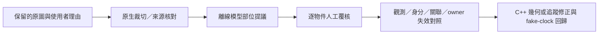

# 離線 CPU 學習視覺小試（2026-10-01）

使用者授權繼續優化、先開發學習式視覺判讀，並明確限定「模型只作為輔助優化」。
本隔離工作樹新增 C++20 `pas_vision_cpu`，已實際在 CPU 訓練小模型、保存權重，
對既有原圖產生視覺分割提議。沒有修改本輪正式 observer／planner，沒有追加實戰。
模型、LibTorch、離線提議不接入 capture→observer→owner 即時迴圈。

這是離線工具與合成學習小試；真實人工像素 gold=0、真實分割準確率 unknown。
不是跨曲 M3／M4 完成、不是 77 Miss 的逐 Note 歸因，也不是遊戲改善驗收。
前輪 C36h 的結果和完整 owner 反事實重播的待辦仍見
[原逐幀報告](DLYROTZ_FRAME_ANALYSIS_C36H_20261001.md)。

## 用途與邊界



模型只接收一張原生 RGB 裁切。歌曲家族、ordinal、QPC、observer ID、觸控日誌都是
離線分組與追溯資料，不輸入模型。輸出是部位 appearance，沒有物理 ID、note→line
關聯、真正／假線語義、撞線時間或動作。白線 appearance 不代表可執行判定線。
不把模型高信心、owner cancel 或 combo 消失當作遊戲 Miss／人工真值。

正式 `pas`／`pas_core` 不連結新模型庫。CMake 的 `PAS_ENABLE_CPU_VISION` 預設 OFF；
開啟只新增獨立 exe／測試與模型庫，使用固定 `2.7.0+cpu` 分發包。
它不是「慢了就跳幀」的 runtime 模型方案，也沒有當前幀模組的模型替換開關。

## 實作及資源

- 全部自有資料、標註 rasterization、分析、訓練及推論邏輯為 C++20。
  第三方 LibTorch CPU 使用官方原版，沒有 CUDA 或 Python 訓練程式。
- 網路：四個 3×3／12-channel 卷積，dilation 1／2／4／8，加 1×1 九類 head；
  4,377 參數、感受野 31px、FP32，沒有預訓練權重。這個工程原型與研究中
  1–5M 參數候選不同，不能拿其成本代表所有模型。
- 輸入 ≤256×256，batch≤4；訓練為 native 64×64 tiles、最多512個覆核 tiles。
  不縮小薄線／Note 核心；模型 tensor 不含 ROI 座標。CPU intra-op4、interop1。
- steps 1–2000、訓練 loop 約240秒上限，optimizer step 途中不強制中斷；
  來源 QA、序列化與獨立合成 evaluation 的時間另在此 loop 外。
  JSON≤1MiB、packet≤24 samples、checkpoint≤1MiB；推論沒有跨幀狀態。
- 模型 proposal gate 為 max probability≥.70、top1−top2≥.15；其他255 ignore。
  門檻只是工程提議，未經信心校準。
- 訓練 batch／loss／gradient 非有限值直接失敗，不取成功子集；predictions 記錄
  nonfinite failures。process 峰值 RSS 尚未量測，不把顯式 tensor 上限当作 RSS。

官方 [LibTorch C++ 安裝](https://docs.pytorch.org/cppdocs/installing.html) 與
[C++ frontend](https://docs.pytorch.org/cppdocs/frontend.html) 支援 CPU 分發包與 C++
訓練／序列化。固定 archive SHA `2267cd447052bc839df147afc03865b5569336f9a45c43841142844e2011a561`，
下載196,059,242 bytes、展開1,154,297,400 bytes；URL及日期保存在 dependency provenance。
第三方依賴＋CPU build另有3GiB容量上限，不用此目錄規避原錄影的8GiB上限。
官方 v2.7.0 [LICENSE](third_party/learning/PyTorch-LICENSE.txt) 隨原型保留；
包內 oneDNN 等 notices 保留於 `libtorch/share/doc`，本輪沒有發布分發包。

## 已執行的合成小試與凍結重現

環境：Windows x64 Release／MSVC v145、Intel Core Ultra5 125H（14核18執行緒）、
32GiB RAM；使用CPU包，Intel Arc不參與推論。emulator未啟動；其他桌面負载與CPU
頻率未鎖定，兩次成本不同不能歸因於模型變快。原生圖固定1280×720／rotation1。

synthetic renderer 隨機產生旋轉線、Tap、灰／藍 Hold head/body/tail、Drag、Flick與特效。
truth由獨立 rasterizer 產生，僅為合成 oracle。訓練 renderer seed `0x123455`、模型seed1337；
evaluation為不同renderer seed `0x895714`的64張64×64。兩種steps設定沿用同一小試evaluation，
沒有獨立最終 test set，也不是跨曲 validation。
renderer的Note與線同向，尚未覆蓋接近時才對齊、按住期間旋轉、跨幀遮擋與多線關聯；
單幀旋轉外觀小試不能回填這些正式幾何／Hold lifecycle的驗收。

|小試|steps|訓練時間|合成 macro IoU，訓練前→後|非有限訓練／推論失敗|
|---|---:|---:|---:|---:|
|v1|300|13.4362s|.00125→.41750|0|
|v2|1200|55.2798s|.00125→.89267|0|
|final，凍結後重現v2|1200|62.2694s|.00125→.89267|0|

v2 合成各類 IoU：background .9994、line appearance .9556、Tap .9681、Hold head
.8577、body .9312、tail .5588、Drag .8679、Flick .9590、effect .9363。tail仍較弱。
v2 checkpoint 24,841 bytes。此處每一項只能證明對簡化 renderer 的學習，不能以
.89267稱真實遊戲89%準確或把合成 oracle 掺入真實人工 gold。
最初兩次exploration未在執行前保存trainer binary SHA，該欄保持null。補齊packet重建
與QA工具後，先凍結CPU binary／source，再重跑同一1200-step設定。共三次訓練執行、
兩種設定；final與v2 checkpoint SHA完全相同，並非第三次調參／選模。
final model SHA `151e47c730e11aa3c06a75a6801650c0832faab6a8d02a80495ce8256d17e8cc`；
CPU tool SHA `cf6c5dac20979224cf5b9cfd8c203cec47045ac0c38f3064b1811d6a92fb00bb`。

|CPU測量／scope|n|p50 ms|p95 ms|p99 ms|max ms|jitter p95−p5 ms|
|---|---:|---:|---:|---:|---:|---:|
|v1 training step，含 forward/loss/backward/update，不含renderer|300|42.2972|52.5468|63.5807|69.5052|15.4518|
|v2 同 scope|1200|43.3222|58.8874|67.5124|95.6251|22.5200|
|final 同 scope|1200|49.9805|56.9605|63.1759|73.0025|11.4561|
|v1 native256² ROI forward＋softmax|18|32.8820|36.5754|38.0060|38.3636|7.6044|
|v2 同 scope|18|17.5987|24.7618|26.0468|26.3681|8.9721|
|final 同 scope|18|34.5084|39.7544|41.2051|41.5678|7.7586|

ROI各暖機3次，量測為主機 QPC wall time；不含PNG QA／解碼、tensor準備、proposal
gate、overlay／HTML寫入。這不是完整1280×720辨識成本，也沒有與 emulator 共載。
不能按像素比例外推完整frame，也不把stage p99相加。所有18張均納入分布。
實際用途維持離線；沒有 CUDA 不妨礙這個小試。

## 真實影格 packet 與初步結論

根目錄：主checkout `measurements/game-assist/2026-09-30-m0-manual-continue/learning-cpu-01`。
全輪7722張與使用者選出的3722張原圖不變。工作 packet 每sample只有一張256²原生
裁切，保留 source PNG／SHA、ordinal、source_frame、capture_complete QPC與1:1 ROI。
QPC屬原session host domain，不當作本次訓練／推論計時。

`packet-v2`18 samples；全部 `Dlyrotz-chart-family`／development，人工reviewed=0、
labeled pixels=0、training ready=false。與原12段的連續PNG／journal相互追溯；
這18張不是完整連續clips，也不表示3722張皆完成像素標註。

|原圖 ordinal|目的／v2提議觀察|可得與不可得的結論|
|---|---|---|
|3495、3497、3498、3501|Hold body提議持續；3495為25,690 pixels、3501為27,615，與anchor切換前後的可見大body相符|可輔助人工定位body；沒有證明同一物理Hold或Move／Up正確|
|4968→4986|灰藍Hold body提議34,345→0；後圖只見特效、但仍有741 Drag／29 Flick提議|可區分body可見與消失的候選案例；不可把特效上proposal當新Note或以消失推出已完成|
|5520|真實紅核心／白箭頭附近仍提議1,796 body、僅72 Flick pixels|明顯domain gap待覆核，不能用合成高IoU替主程式合併／分類|
|6214|側向Drag與染色線附近有400 Drag、1,266 line appearance及2,771 effect提議|可分層輔助覆核；不能確認可執行線、關聯、root或遊戲命中|
|5287|保留使用者指定的正常90秒對照|不因模型給出proposal就把正常片段改為失敗案例|

這是助理對圖與proposal的質性觀察，非人工 mask gold。小試已有資訊可覆核，但合成
模型對美術、白輪廓、Flick與特效的真實分類不足；本輪停止於兩次有界bootstrap，
不繼續用同一合成evaluation反覆選模。

packet-v1／proposals-v1完整保留，標為superseded：初始「閃爍前」ordinal4975實際已在
Hold消失後，且x180裁切只含背景。覆核原圖後改为4968／4986同一x630,y320裁切，
存新packet-v2，沒有覆寫或刪除原試驗。3964的過度具體敘述也已在原分析報告更正。

下一個可驗證優化假說是「body依然可見時，observer的patch/front／線ID切換使owner
接觸失支持」。先按可見 body/rail 分割，把 observer 與 owner 的失支持事件精確 join，
再以暖機的完整 owner→FakeTouch 重播定位邊界；修正才轉成有界 C++ 幾何／關聯。
body不可見、假線、已Down未知、真正新Note均須保留反例。模型不延長lease、不替未知
Down創造重試資格；上述全鏈重播目前仍未實作。

## 覆核及再次訓練

`proposals-final/review.html`並列原生ROI及overlay；`predictions.json`保存每類／ignore的
提議pixel數。`packet-v2/sample-*/annotation.json`是人工覆核入口；模型mask放在
另一目錄，不偷偷覆蓋人工semantic/instance。先複製packet為review工作副本再編輯，
保留原packet，且依同一campaign帳本預留新增容量。

|semantic|標註內容|instance|
|---:|---|---|
|0|明確背景|0|
|1|可見線外觀，role仍unknown|1..65534，type `line_appearance`|
|2|Tap可見核心|1..65534，type `tap`|
|3／4／5|Hold可見head／body／tail|同一可見Hold各部位共用ID，type `hold`|
|6／7|Drag／Flick可見核心|1..65534，type `drag`／`flick`|
|8|明確特效|0|
|255|不知道／未標／遮擋處|65535|

`polygons`使用ROI局部pixel座標，按pixel center rasterize；後polygon覆蓋可見上層。
不可補不可見head/tail，不沿過去位置延續已消失body。Flick箭頭是否屬同圖形先覆核，
物件ID為此sample局部ID，與runtime ID無關。跨幀物理身分／關聯另記unknown，不由此模型產生。

每個非背景物件需 `instance/type/amodal:false/visibility/truncated/type_uncertainty`。
line appearance另需ROI局部兩點 `centerline`、`line_role:"unknown"`；本pilot不接受
把pixels分類直接標成可執行線。Hold部位只標看得到部分，物件type需匹配mask類別。
以下只是格式範例，不是對任何影格的gold；可見body多邊形仍須逐圖繪製及覆核：

```json
{
  "review_status": "proposed",
  "reviewer": "",
  "objects": [{"instance": 101, "type": "hold", "amodal": false,
    "visibility": "partial", "truncated": true, "type_uncertainty": "head/tail unknown"}],
  "polygons": [{"semantic": 4, "instance": 101,
    "points": [[30,10],[90,10],[90,150],[30,150]]}]
}
```

保留每sample既有schema／image_sha256／source／roi等其他欄位。完成獨立人工核對後才設
`review_status:"reviewed_human"`、填實際reviewer；Codex與模型
提議仍用proposed。既有 Reasons.md是使用者文字觀察，不會因此升格為像素gold。

以下在隔離工作樹執行，`$pilot`指上面的learning-cpu-01；輸出必須是全新目錄：

```powershell
$vision = '.\out\vision-cpu-v145\Release\pas_vision_cpu.exe'
& $vision audit "$pilot\packet-v2"
# 修改過polygon的工作副本：輸出新packet，保留來源mask。
& $vision rasterize "$pilot\review-working-v1" "$pilot\reviewed-packet-v1"
& $vision audit "$pilot\reviewed-packet-v1"
# 必須所有sample有實際reviewer、有可見label、QA一致，否則不建立訓練輸出。
& $vision train-reviewed "$pilot\reviewed-packet-v1" "$pilot\real-development-model-v1" 1200
& $vision predict "$pilot\real-development-model-v1" "$pilot\reviewed-packet-v1" "$pilot\real-proposals-v1"
```

QA核對來源SHA、annotation provenance、每個native crop pixel、物件類型、polygon重建
兩張mask與bit depth、路徑、重複RGB、reviewer與家族split。`audit`不通過回傳2，
例外回傳1；proposed train-reviewed在建立輸出／optimizer前拒絕。
重建不更改review status、不会創造gold；manifest靜態human_gold欄維持0，當前覆核量
以audit報告為準。所有Dlyrotz仍是development；不能拿相鄰影格隨機切為validation。
真正跨曲評估要另有經覆核的獨立歌曲／譜面家族；本pilot未實作該評估入口。

## 構建與可重現證據

建置目錄 `out/vision-cpu-v145`，Release CPU目標 `pas_vision_cpu`及`pas_vision_cpu_tests`；
沿用現有vcpkg dependency，不重開擷取選型。configure需 `PAS_ENABLE_CPU_VISION=ON`、
`Torch_DIR=out/dependencies/libtorch-cpu-2.7.0/libtorch/share/cmake/Torch`（使用絕對路徑）。
普通PAS build不需要Torch_DIR，預設OFF。

新測試驗證 CPU optimizer更新、權重序列化一致、ignore loss、輸入上限、proposed
訓練拒絕、reviewer/來源、家族split與路径、原生crop/mask不一致、缺物件及新packet重建。
8項新測試全通過（6.20s），無skip／fail；結果與CPU binary、source SHA、依賴文件、
資料字節／狀態另存 `experiment-audit.json`。
既有C36h正式binary SHA `61ecfacd2cc48ed270506719a1089be646d915c64e9026706ac1654e0d4bbce9`
保持不變；模型只在獨立CPU exe載入。保留之前失敗測試logs及修正後結果。

原campaign保留8GiB hard bound，本輪先預留128MiB（測量前7,624,619,311 bytes）；
原12輪仍closed、live新增0。兩種設定的三次CPU訓練、原生packet、提議、freeze及logs納入同一
資料帳本；實際總量以最後capacity audit為準。沒有資料上傳、雲端訓練或訓練服務。
